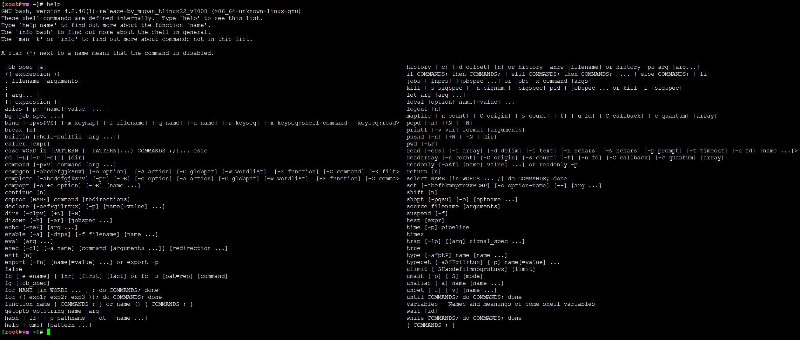
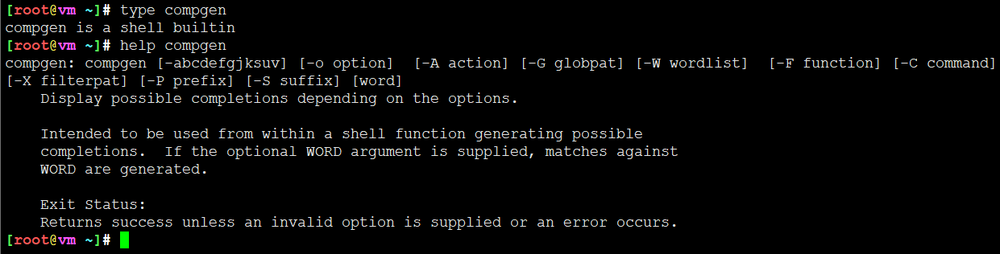
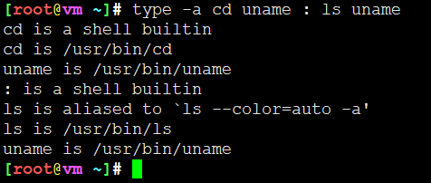
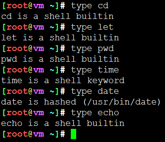
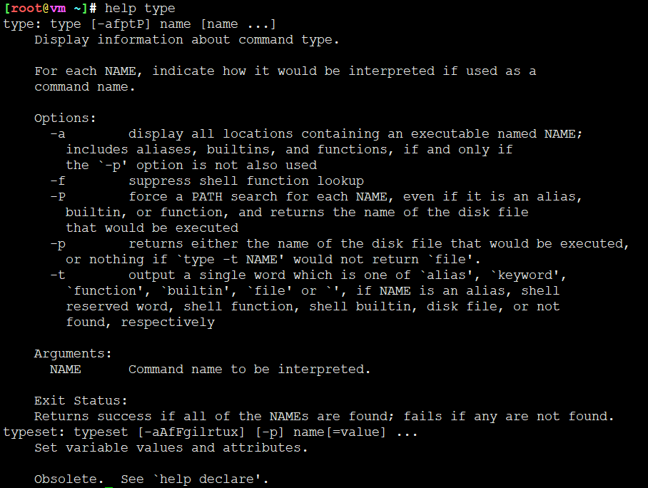
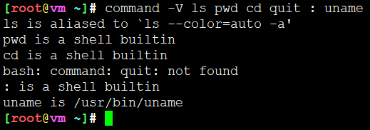
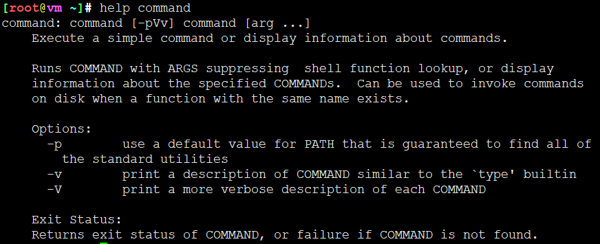
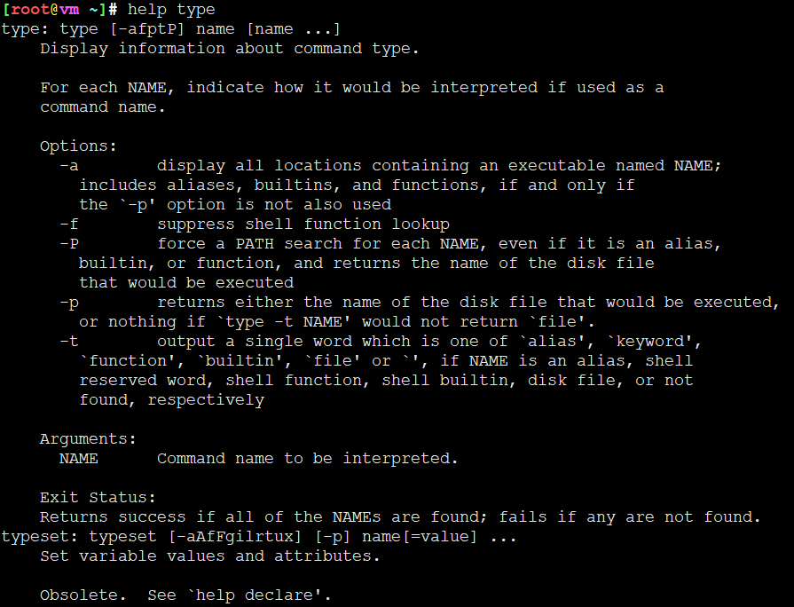
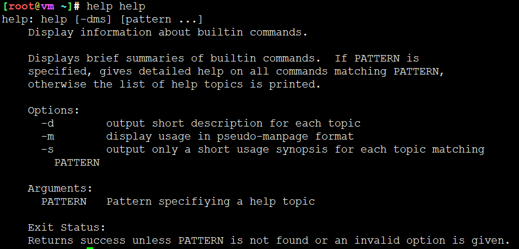

<!-- MDTOC maxdepth:6 firsth1:1 numbering:0 flatten:0 bullets:1 updateOnSave:1 -->

- [bash内置命令](#bash内置命令)   
   - [如何查看所有bash内置命令](#如何查看所有bash内置命令)   
   - [判断命令是内部的（内置）还是外部的](#判断命令是内部的（内置）还是外部的)   
   - [内建命令帮助信息](#内建命令帮助信息)   

<!-- /MDTOC -->
# bash内置命令

## 如何查看所有bash内置命令

方法一： 通过help命令查看



```
job_spec [&]                                                                                                       
history [-c] [-d offset] [n] or history -anrw [filename] or history -ps arg [arg...]
(( expression ))                                                                                                   
if COMMANDS; then COMMANDS; [ elif COMMANDS; then COMMANDS; ]... [ else COMMANDS; ] fi
. filename [arguments]                                                                                             
jobs [-lnprs] [jobspec ...] or jobs -x command [args]
:                                                                                                                  
kill [-s sigspec | -n signum | -sigspec] pid | jobspec ... or kill -l [sigspec]
[ arg... ]                                                                                                         
let arg [arg ...]
[[ expression ]]                                                                                                   
local [option] name[=value] ...
alias [-p] [name[=value] ... ]                                                                                     
logout [n]
bg [job_spec ...]                                                                                                  
mapfile [-n count] [-O origin] [-s count] [-t] [-u fd] [-C callback] [-c quantum] [array]
bind [-lpvsPVS] [-m keymap] [-f filename] [-q name] [-u name] [-r keyseq] [-x keyseq:shell-command] [keyseq:read>  
popd [-n] [+N | -N]
break [n]                                                                                                          
printf [-v var] format [arguments]
builtin [shell-builtin [arg ...]]                                                                                  
pushd [-n] [+N | -N | dir]
caller [expr]                                                                                                      
pwd [-LP]
case WORD in [PATTERN [| PATTERN]...) COMMANDS ;;]... esac                                                         
read [-ers] [-a array] [-d delim] [-i text] [-n nchars] [-N nchars] [-p prompt] [-t timeout] [-u fd] [name ...]>
cd [-L|[-P [-e]]] [dir]                                                                                            
readarray [-n count] [-O origin] [-s count] [-t] [-u fd] [-C callback] [-c quantum] [array]
command [-pVv] command [arg ...]                                                                                   
readonly [-aAf] [name[=value] ...] or readonly -p
compgen [-abcdefgjksuv] [-o option]  [-A action] [-G globpat] [-W wordlist]  [-F function] [-C command] [-X filt>  
return [n]
complete [-abcdefgjksuv] [-pr] [-DE] [-o option] [-A action] [-G globpat] [-W wordlist]  [-F function] [-C comma>  
select NAME [in WORDS ... ;] do COMMANDS; done
compopt [-o|+o option] [-DE] [name ...]                                                                            
set [-abefhkmnptuvxBCHP] [-o option-name] [--] [arg ...]
continue [n]                                                                                                       
shift [n]
coproc [NAME] command [redirections]                                                                               
shopt [-pqsu] [-o] [optname ...]
declare [-aAfFgilrtux] [-p] [name[=value] ...]                                                                     
source filename [arguments]
dirs [-clpv] [+N] [-N]                                                                                             
suspend [-f]
disown [-h] [-ar] [jobspec ...]                                                                                   
test [expr]
echo [-neE] [arg ...]                                                                                             
time [-p] pipeline
enable [-a] [-dnps] [-f filename] [name ...]                                                                      
times
eval [arg ...]                                                                                                     
trap [-lp] [[arg] signal_spec ...]
exec [-cl] [-a name] [command [arguments ...]] [redirection ...]                                                   
true
exit [n]                                                                                                           
type [-afptP] name [name ...]
export [-fn] [name[=value] ...] or export -p                                                                       
typeset [-aAfFgilrtux] [-p] name[=value] ...
false                                                                                                              
ulimit [-SHacdefilmnpqrstuvx] [limit]
fc [-e ename] [-lnr] [first] [last] or fc -s [pat=rep] [command]                                                   
umask [-p] [-S] [mode]
fg [job_spec]                                                                                                      
unalias [-a] name [name ...]
for NAME [in WORDS ... ] ; do COMMANDS; done                                                                       
unset [-f] [-v] [name ...]
for (( exp1; exp2; exp3 )); do COMMANDS; done                                                                      
until COMMANDS; do COMMANDS; done
function name { COMMANDS ; } or name () { COMMANDS ; }                                                             
variables - Names and meanings of some shell variables
getopts optstring name [arg]                                                                                       
wait [id]
hash [-lr] [-p pathname] [-dt] [name ...]                                                                          
while COMMANDS; do COMMANDS; done
help [-dms] [pattern ...]                                                                                          
{ COMMANDS ; }
```

方法二：通过compgen命令查看




```
[root@vm ~]# compgen -b
.
:
[
alias
bg
bind
break
builtin
caller
cd
command
compgen
complete
compopt
continue
declare
dirs
disown
echo
enable
eval
exec
exit
export
false
fc
fg
getopts
hash
help
history
jobs
kill
let
local
logout
mapfile
popd
printf
pushd
pwd
read
readarray
readonly
return
set
shift
shopt
source
suspend
test
times
trap
true
type
typeset
ulimit
umask
unalias
unset
wait
```

## 判断命令是内部的（内置）还是外部的

方法一： type命令

```
[root@vm ~]# type type
type is a shell builtin
```

* type命令本身也是bash内建命令
* ```help type```查看内置命令type的帮助信息







方法二： command命令

* 如果是內置命令，command默认没有输出，可以添加-V参数显示详细信息
* ```help command``` 查看内置命令command的帮助信息





## 内建命令帮助信息

* 内建命令通过help(内建命令)来获取帮助信息






---
