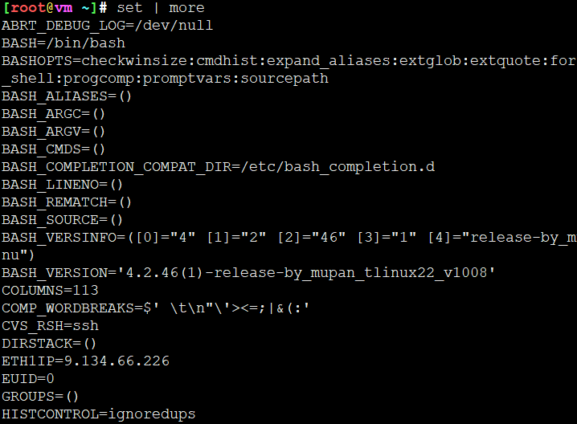
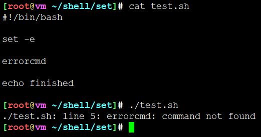
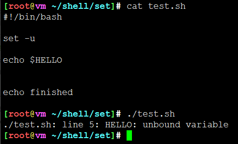
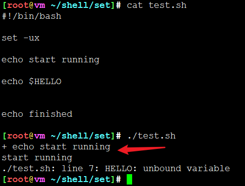

<!-- MDTOC maxdepth:6 firsth1:1 numbering:0 flatten:0 bullets:1 updateOnSave:1 -->

- [set](#set)   
   - [不带参数的set命令用来显示环境变量](#不带参数的set命令用来显示环境变量)   
   - [遇到错误就退出 -e 或者 -o errexit](#遇到错误就退出-e-或者-o-errexit)   
   - [遇到不存在的变量就退出 -u 或者 -o nounset](#遇到不存在的变量就退出-u-或者-o-nounset)   
   - [执行的时候输出对应的命令 -x 或者 -o xtrace](#执行的时候输出对应的命令-x-或者-o-xtrace)   

<!-- /MDTOC -->
# set

set命令是 Bash 脚本的重要环节，却常常被忽视，导致脚本的安全性和可维护性出问题。本文介绍它的基本用法，让你可以更安心地使用 Bash 脚本。

| 选项           | 说明                                           |
| -------------- | ---------------------------------------------- |
| -a             | 显示修改的变量                                 |
| -u /-o nounset | 遇到不存在的变量报错并退出执行                          |
| -x /-o xtrace  | 调试输出                                       |
| -e /-o errexit | 执行遇到错误就退出                             |
| -eo pipefail   | 只要一个子命令失败，管道命令失败，脚本终止执行 |
| -euxo pipefial | 遇到不存在变量退出，执行错误退出，管道失败退出，调试输出 |
|                |                                                |

## 不带参数的set命令用来显示环境变量

## 遇到错误就退出 -e 或者 -o errexit

* 遇到不存在命令执行错误退出，后序命令不执行

## 遇到不存在的变量就退出 -u 或者 -o nounset

* HELLO变量未定义，后序命令未执行

## 执行的时候输出对应的命令 -x 或者 -o xtrace

* 对应的命令会以+开头形式输出

--
