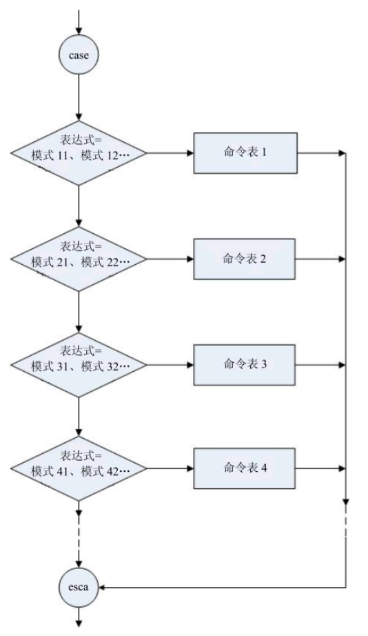
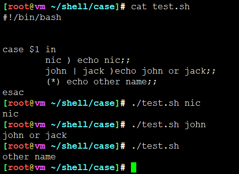

# case

## 基本格式

if的多条件判断格式如下：

```
if 判断条件1 ;then 命令区域1
else if 判断条件2 ;then 命令区域2
else if 判断条件3 ;then 命令区域3
else if 判断条件4 ;then 命令区域4
else if 判断条件5 ;then 命令区域5
else 命令区域;fi
```

写成case：

```
case 待测项 in
  匹配模式1 ) 命令区域1 ;;
  匹配模式2 ) 命令区域2 ;;
  匹配模式3 ) 命令区域3 ;;
  匹配模式4 ) 命令区域4 ;;
  匹配模式5 ) 命令区域5 ;;
  ...
  *) 命令区域 ;;
esac
```

相比于if的改进点：

1. 减少代码字符，少敲好几个字符
2. 更简洁，结构紧凑
3. 方便日后维护

结构说明：

1. 待测项 **依次**与模式进行匹配，执行第一个配对中的命令区域
2. 每一分支中的模式，可以有多个，但必须以**)**结尾，左边括号可以有也可以没有
3. 命令表可以是一个命令或多个命令，多个命令可以多行写，最后一个命令要以;;结束
4. 分支语句的个数没有规定，可以无限制地增加。每一分支以**;;**表示该分支结束
5. 分支***)**是表示在前面所有可能的匹配都不满足时的处理方式，不一定要有，如果有一定放在最后
6. esac表示case结构结束，esac是case的反写
7. 模式中可以使用|，表示各模式之间是“或”的关系。例如，P|p意味着大写和小写的p都可匹配
8. 模式中可以使用Shell通配符，如*、?和[]等。

典型的case执行流程如图：




## 举栗子

### 基本用法



### 使用shopt增强case模式匹配

* 是否执行命令区域前提是待测项与模式匹配。

基本的模式匹配包括：

1. 字符串
2. 通配符。```*```表任意长度字符串，也可以包含空字符串。```？```表示一个任意字符
3. 字符集合。如 ```[abcd]efg```
4. 分隔符。如 ```a|b```

通过shopt开启扩展匹配。涉及shopt相关内容请查看：[shopt](docs/bash内置命令/shopt.md)

```
shopt -s extglob # 开启扩展匹配
shopt -u extglob # 关闭扩展匹配
```

扩展匹配模式包括：

1. ?(模式) :如果符合 **0个或1个** 以上括号里的模式就算符合
2. *(模式) :如果符合 **0个以上** 括号里的模式就算符合
3. +(模式) :如果符合 **1个以上** 括号里的模式就算符合
4. @(模式) :如果符合 **1个** 括号里的模式就算符合
5. !(模式) :不出现括号里的模式匹配就算符合


---
