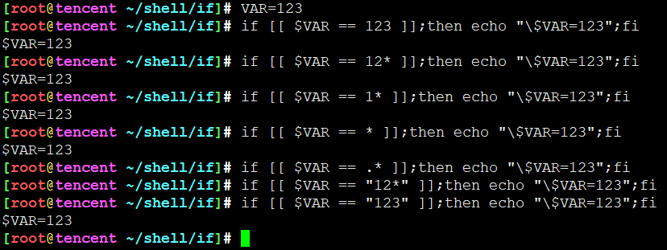
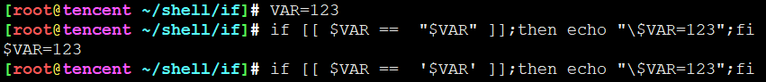
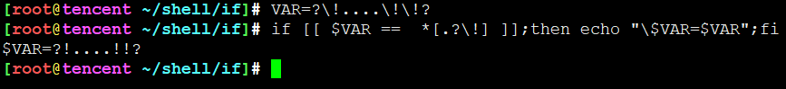
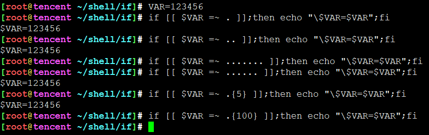
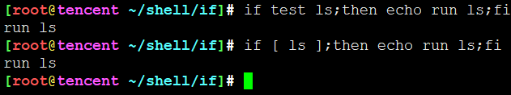
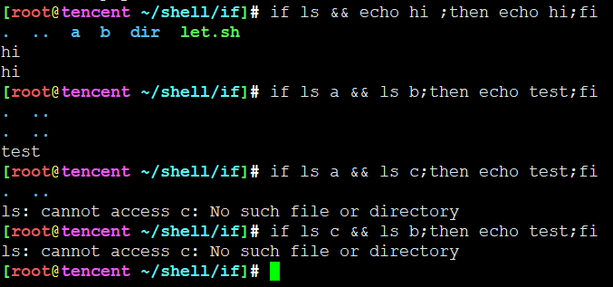
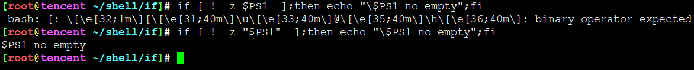
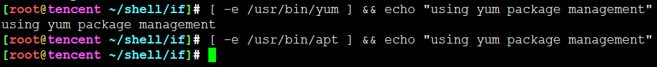
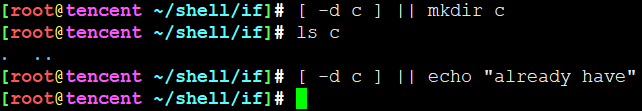

<!-- MDTOC maxdepth:6 firsth1:1 numbering:0 flatten:0 bullets:1 updateOnSave:1 -->

- [if](#if)   
   - [if判断相关的关键字](#if判断相关的关键字)   
   - [基本格式](#基本格式)   
   - [十种条件测试](#十种条件测试)   
      - [执行某一个命令的结果](#执行某一个命令的结果)   
      - [传回某个命令执行结果的相反值](#传回某个命令执行结果的相反值)   
      - [带(())符号作为条件判断-内置命令let](#带符号作为条件判断-内置命令let)   
      - [带[[]]符号组成的条件判断](#带符号组成的条件判断)   
      - [使用内置命令: test "判断式"](#使用内置命令-test-判断式)   
      - [带[]符号作为条件判断-内置命令test](#带符号作为条件判断-内置命令test)   
      - [使用 -a,-o 进行逻辑组合](#使用-a-o-进行逻辑组合)   
      - [命令1&&命令2](#命令1命令2)   
      - [命令1||命令2](#命令1命令2)   
      - [&&与||合用](#与合用)   
   - [条件判断式](#条件判断式)   
      - [文件判断](#文件判断)   
      - [字符串比较](#字符串比较)   
      - [数值比较](#数值比较)   
      - [bash选项的条件判断](#bash选项的条件判断)   

<!-- /MDTOC -->
# if

## if判断相关的关键字

1. if
2. then
3. else
4. elif **(PS:不是else if)**
5. fi

## 基本格式

* 一行if至少三部分构成，各个部分用分号隔开
* if和条件测试要有空格
* 条件测试和分号不需要空格
* then和命令区域要有空格
* 命令区域和分号不需要空格
* fi命令和分号不需要空格
* 总结: **空格只需要在命令和条件测试左右出现就可以，不论多少，有一个就够了**

```
if 条件测试;then 命令区域;fi
```

* 单一处理的写法
* 其中命令区域不要求缩进，不过为了方便阅读建议格式化
* then可以跟if在同一行，但必须要求then前面有分号。也可另起一行，就不需要分好了。任何使用情况下then都是如此操作
* 比较受欢迎的写法是把then与if放在同一行，减少脚本行数。
* 命令区域可以不止一行，知道出现后序关键词为止。如果没有fi命令，if语句不会结束

```
if 条件测试 ;then
  命令区域
fi

或者

if 条件测试
then
  命令区域
fi
```

* 双处理写法

```
if 条件测试 ;then
  命令区域
else
  命令区域
fi

或者

if 条件测试
then
  命令区域
else
  命令区域
fi
```

* 包含if相关5个关键字的写法
* 多处理写法，超多处理写法用case

```
if 条件测试 ;then
  命令区域
elif 条件测试;then
  命令区域
elif 条件测试;then
  命令区域
elif 条件测试;then
  命令区域
else
  命令区域
fi
```

## 十种条件测试

### 执行某一个命令的结果

1. 如果命令执行成功，命令的返回状态码为0，条件判断为True。否则为False
2. 返回状态码通过特殊变量**$?**表示


通过这个例子可以看出，条件判断里面执行的命令返回状态会赋值给 **$?** 特殊环境变量，而不是之前的命令执行结果赋值给 **$?**

### 传回某个命令执行结果的相反值

1. 通过if/elif与判断条件之间添加**!**，进行取反操作
2. **!** 两边必须至少有一个空字符

### 带(())符号作为条件判断-内置命令let

* 运算结果不为0就返回False，否则返回True。0为真True，非0为假False
* 就算是负数也是返回True，只有，切记，只有0才返回False
* **(( 算式 ))  本质就是 let “算式”**，let是bash的内置命令
* **(( 算式 ))** 算式左右与括号之间必须要有空格(空字符)


* (())是bash的复合命令，内置算式。因为它自己用到了自己内置的模块，是由多个小功能协作完成
* 什么叫内置，按理说一个程序如果只负责一个小功能，太分散了。那么把多个程序集成到一个程序也是可以的。busybox就是典型的例子。
* **((算式))** 可以对算式的运算结果传回真假值。**非0就是真，0就是假**

**((算式))  本质就是 let “算式”**

* 如果去查看let 的man帮助，会发现他其实就是bash内置命令


* 按理说**算式两边的引号不可以少**，实际也能跑通，**书写规范及避免犯错，最好加上引号**
* *(())很自由，不需要转义** ，对于<、>、&&、||可以自由使用，不用转义。记忆：多写了一堆括号，好处肯定要有，不然白写


### 带[[]]符号组成的条件判断

* [[ 的前后至少一个空格，```if [[ 条件判断```
* ]] 的前面至少一个空格，```条件判断 ]]```
* ]];then 是可以的，所以]]后面不一定要空格，有也是可以的。```[[ 条件判断 ]];then ```


通过这个例子可以看出，

1. **[[ 条件判断 ]]**里面执行的命令返回状态会赋值给 **$?** 特殊环境变量，而不是之前的命令执行结果赋值给 **$?**
2. 条件判断里面执行命令的输出内容不会在终端打印

**[[]]比[]更自由，不需要转义** ，对于<、>、&&、||可以自由使用，不用转义。记忆：多写了一堆括号，好处肯定要有，不然白写





通过这个例子可以看出，

1. [[ ]]中，如果用到 == 或 != ，如果这两个运算符**右**方的字符串没有加上单引号或双引号，那么就会被视为模式匹配。加上单引号或双引号就是字符串配对，双引号中会变量替换，单引号不会



通过这个例子可以看出，

1. ```*[.?\!]```模式匹配规则，是否仅包含. ? !这三种字符的任意一种字符作为字符串结尾，其中!需要转义

bash 3.2版本之后支撑增强版正则表达式匹配，其用法与perl正则表达式差不多

```
[[ 字符串 =~ 匹配模式 ]]
```



通过这个例子可以看出，

1.  不是精确匹配，最少有多少字符。任意匹配上的字符最少有多少个


### 使用内置命令: test "判断式"

格式:

```
if test "判断式";then
  命令区域
elif test "判断式";then
  命令区域
fi
```


* test是bash的内置命令
* **大于符号、小于符号对bash而言是特殊字符，必须要经过转义**


### 带[]符号作为条件判断-内置命令test

格式:

```
if [ 判断式 ];then
  命令区域
elif [ 判断式 ];then
  命令区域
fi
```

* 带[]符号的内置命令 其实 跟 test "判断式" 是一样一样的
* 对bash而言特殊的字符需要转义，大于号，小于号，还有哪些？



### 使用 -a,-o 进行逻辑组合

```
if [ -r file1 -a -x file2 ];then
  命令区域
fi


if [ -r file1 -a -x file2 ];then
  命令区域
fi
```

### 命令1&&命令2

```
if 命令1 参数 && 命令2 参数;then
  命令区域
fi
```
* && 称为逻辑AND，**前一个为假就立即为假，后一个都不执行**



* if判断式左右没有任何括号，会把命令执行结果在终端输出。



* 判断里面尽量加引号，一个好的习惯减少超级多错误
* **凡是 ```[ 判断式 ] && 命令``` 的形式都被视为隐形的if-true-then写法**，举例：判断命令是否存在



* 有一个误区，if 判断式中真假应该用True和False表示，而不是0和非0。不然真真用的时候回反过来。
* **True = 0，False = !0**

### 命令1||命令2

```
if 命令1 参数 || 命令2 参数;then
  命令区域
fi
```

* || 称为逻辑OR，**只有前一个为假才会执行第二个**
* **凡是 ```[ 判断式 ] || 命令``` 的形式都被视为隐形的if-false-then写法**，举例：创建新目录




### &&与||合用


```
if 命令1 参数 && 命令2 参数 || 命令3 ;then
  命令区域
fi
```

* **凡是 ```[ 判断式 ] && 命令 || 命令 ``` 的形式都被视为隐形的if-then-else写法**


## 条件判断式

### 文件判断

| 判断式   | 什么情况下为真             |
| -------- | -------------------------- |
| -a  文件 | 如果文件存在               |
| -b  文件 | 如果文件存在，且为块设备   |
| -c  文件 | 如果文件存在，且为字符设备 |
| -d  文件 | 如果文件存在，且为目录     |
| -e  文件 | 文件存在，不管类型，有就行 |
| -f  文件 | 文件存在，且必须为普通文件 |
| -r  文件 | 文件存在，且可读           |
| -w  文件 | 文件存在，且可写           |
| -x  文件 | 文件存在，且可执行         |
需要特别对待的


| 判断式          | 什么情况下为真                     |
| --------------- | ---------------------------------- |
| -s  文件        | 如果文件存在，且非空               |
| -h  文件        | 文件存在，且为符号链接             |
| -p  文件        | 文件存在，且为管道文件             |
| -O  文件        | 如果文件存在，且执行用户所有       |
| -G  文件        | 如果文件存在，且执行用户所在组     |
| -g  文件        | 文件存在，并且设定group id属性     |
| -u  文件        | 文件存在，并且设定user id属性      |
| -S  文件        | 文件存在，并且设定sticky属性       |
| -t 文件描述符   | 文件描述符开启，且链接了某个终端   |
| -N  文件        | 文件存在，且自从上次读取后被修改过 |
| FileA -nt FileB | FileA比FileB新，newer than         |
| FileA -ot FileB | FileA比FileB旧，older than         |


### 字符串比较

| 判断式       | 什么情况下为真             |
| ------------ | -------------------------- |
| STR1 = STR2  | 相同                       |
| STR1 == STR2 | 相同                       |
| STR1 != STR2 | 不相同                     |
| STR1 < STR2  | 小                         |
| STR1 > STR2  | 大                         |
| -n  STR      | not zero 非0长度，非空字符 |
| -z  STR      | 字符串长度为0              |
| STR          | 字符串长度不为0            |

### 数值比较

| 判断式        | 什么情况下为真 |
| ------------- | -------------- |
| NUM1 -eq NUM2 | qeual          |
| NUM1 -ge NUM2 | greater equal  |
| NUM1 -gt NUM2 | greater than   |
| NUM1 -le NUM2 | less queal     |
| NUM1 -lt NUM2 | leas than      |
| NUM1 -ne NUM2 | not qeual      |


### bash选项的条件判断

| 判断式       | 什么情况下为真             |
| ------------ | -------------------------- |
| -o set的选项名称  | 该选项是开启状态                       |


---
