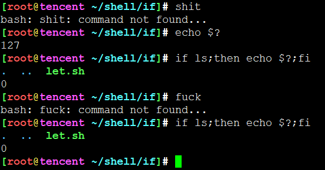
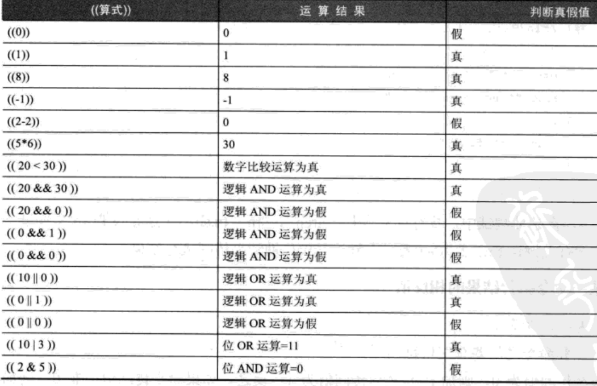
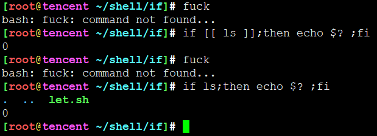
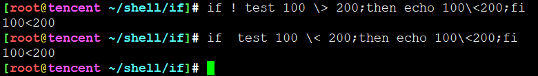
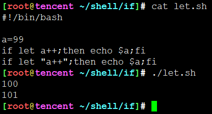

<!-- MDTOC maxdepth:6 firsth1:1 numbering:0 flatten:0 bullets:1 updateOnSave:1 -->

- [if](#if)   
   - [if判断相关的关键字](#if判断相关的关键字)   
   - [基本格式](#基本格式)   
   - [十种条件测试](#十种条件测试)   
      - [执行某一个命令的结果](#执行某一个命令的结果)   
      - [传回某个命令执行结果的相反值](#传回某个命令执行结果的相反值)   
      - [带(())符号的内置命令作为条件判断](#带符号的内置命令作为条件判断)   
      - [带[[]]符号组成的条件判断](#带符号组成的条件判断)   
      - [使用内置命令: test "判断式"](#使用内置命令-test-判断式)   
      - [带[]符号的内置命令作为条件判断](#带符号的内置命令作为条件判断)   
   - [带[]的条件测试](#带的条件测试)   
   - [带()的条件测试](#带的条件测试)   
   - [带(())的条件测试](#带的条件测试)   

<!-- /MDTOC -->
# if

## if判断相关的关键字

1. if
2. then
3. else
4. elif **(PS:不是else if)**
5. fi

## 基本格式

* 一行if至少三部分构成，各个部分用分号隔开
* if和条件测试要有空格
* 条件测试和分号不需要空格
* then和命令区域要有空格
* 命令区域和分号不需要空格
* fi命令和分号不需要空格
* 总结: 空格只需要在命令和条件测试左右出现就可以，不论多少，有一个就够了

```
if 条件测试;then 命令区域;fi
```

* 单一处理的写法
* 其中命令区域不要求缩进，不过为了方便阅读建议格式化
* then可以跟if在同一行，但必须要求then前面有分号。也可另起一行，就不需要分好了。任何使用情况下then都是如此操作
* 比较受欢迎的写法是把then与if放在同一行，减少脚本行数。

```
if 条件测试 ;then
  命令区域
fi

或者

if 条件测试
then
  命令区域
fi
```

* 双处理写法

```
if 条件测试 ;then
  命令区域
else
  命令区域
fi

或者

if 条件测试
then
  命令区域
else
  命令区域
fi
```

* 包含if相关5个关键字的写法
* 多处理写法，超多处理写法用case

```
if 条件测试 ;then
  命令区域
elif 条件测试;then
  命令区域
elif 条件测试;then
  命令区域
elif 条件测试;then
  命令区域
else
  命令区域
fi
```

## 十种条件测试

### 执行某一个命令的结果

1. 如果命令执行成功，命令的返回状态码为0，条件判断为True。否则为False
2. 返回状态码通过特殊变量**$?**表示




通过这个例子可以看出，条件判断里面执行的命令返回状态会赋值给 **$?** 特殊环境变量，而不是之前的命令执行结果赋值给 **$?**

### 传回某个命令执行结果的相反值

1. 通过if/elif与判断条件之间添加**!**，进行取反操作
2. **!** 两边必须至少有一个空字符

### 带(())符号的内置命令作为条件判断

* 运算结果不为0就返回False，否则返回True
* 就算是负数也是返回True，只有，切记，只有0才返回False
* **(( 算式 ))  本质就是 let “算式”**，let是bash的内置命令
* **(( 算式 ))** 算式左右与括号之间必须要有空格(空字符)



### 带[[]]符号组成的条件判断

* [[ 的前后至少一个空格，```if [[ 条件判断```
* ]] 的前面至少一个空格，```条件判断 ]]```
* ]];then 是可以的，所以]]后面不一定要空格，有也是可以的。```[[ 条件判断 ]];then ```



通过这个例子可以看出，
1. **[[ 条件判断 ]]**里面执行的命令返回状态会赋值给 **$?** 特殊环境变量，而不是之前的命令执行结果赋值给 **$?**
2. 条件判断里面执行命令的输出内容不会在终端打印

### 使用内置命令: test "判断式"

* test是bash的内置命令
* **大于符号、小于符号对bash而言是特殊字符，必须要经过转义**



### 带[]符号的内置命令作为条件判断


## 带[]的条件测试

## 带()的条件测试

## 带(())的条件测试

* (())是bash的复合命令，内置算式。因为它自己用到了自己内置的模块，是由多个小功能协作完成
* 什么叫内置，按理说一个程序如果只负责一个小功能，太分散了。那么把多个程序集成到一个程序也是可以的。busybox就是典型的例子。
* **((算式))** 可以对算式的运算结果传回真假值。**非0就是真，0就是假**

**((算式))  本质就是 let “算式”**

* 如果去查看let 的man帮助，会发现他其实就是bash内置命令



* 按理说**算式两边的引号不可以少**，实际也能跑通，**书写规范及避免犯错，最好加上引号**

---
