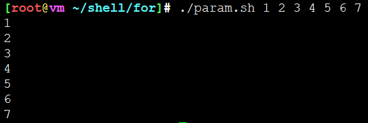
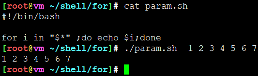
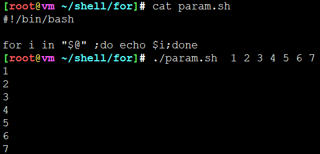

# for

## 基本语法

```
for 变量 in 串行
do
  命令区域
done
```

* 将串行元素依次去除，存放到指定名称的变量中，重复执行命令区域，直到所有元素取尽位置。
* 串行是一些字符串的组合，彼此用**$IFS**所定义的字符隔开，这些字符串成为字段

## 举栗子

### 最基本计数for循环

```
for i in 1 2 3 4 5 6 7 8
do
  echo $i
done

或者

for i in 1 2 3 4 5 6 7;do echo $i;done

```

### for输出参数

```
for i in $@
do
  echo $i
done

或者

for i in $@ ;do echo $i;done
```









---
