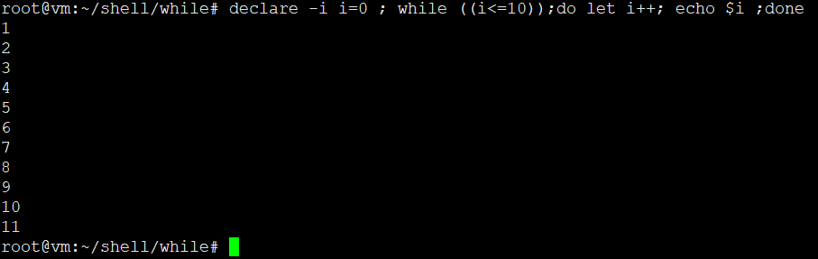

# while

```
while 条件测试
do
  命令区域
done

或

while 条件测试;do 命令区域;done

```

## 举栗子

### 简单计数

```
declare -i i=0 ; while ((i<=10));do let i++; echo $i ;done

或

declare -i i=0
while ((i<=10))
do
  let i++
  echo $i
done
```



### 读取文件

```
while read line ;do echo $line;done < /proc/cpuinfo

或


while read line
do
	echo $line
done <  /proc/cpuinfo

```
