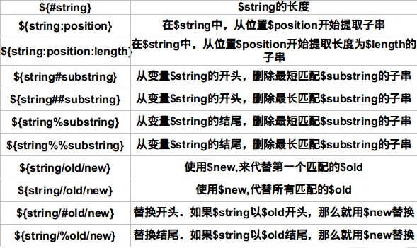
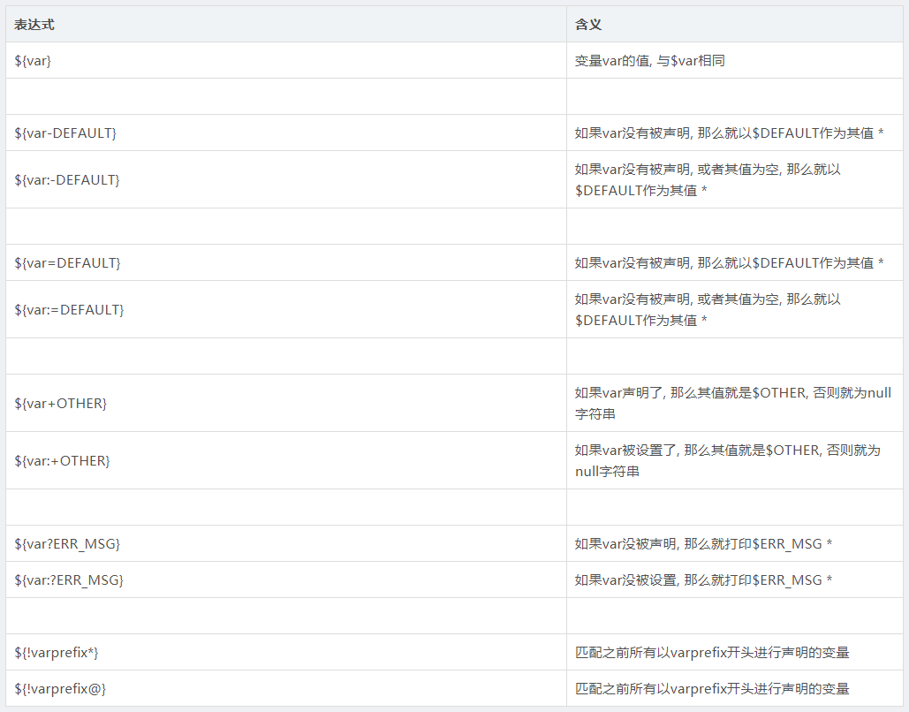
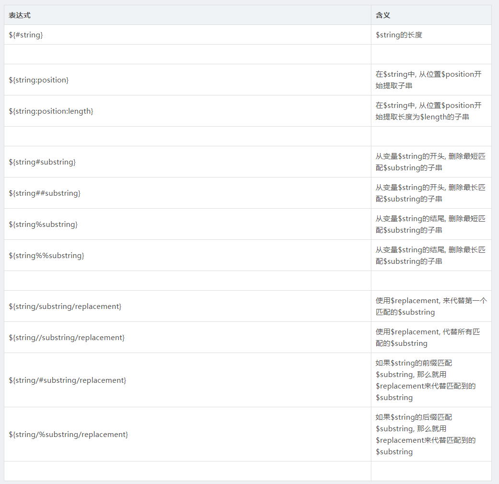
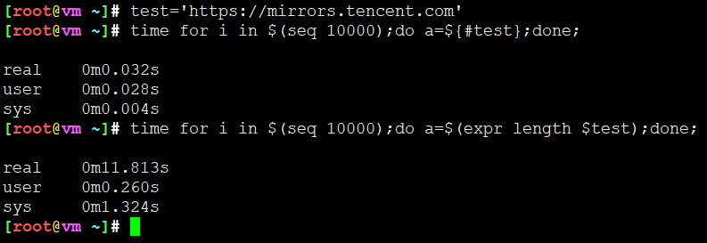

<!-- MDTOC maxdepth:6 firsth1:1 numbering:0 flatten:0 bullets:1 updateOnSave:1 -->

- [字符串变量](#字符串变量)   
   - [快速浏览](#快速浏览)   
   - [判断读取字符串值](#判断读取字符串值)   
   - [获取字符串长度](#获取字符串长度)   
   - [8种字符串截取方法](#8种字符串截取方法)   
      - [1.删除左边字符，保留右边字符: # 就近匹配截取](#1删除左边字符，保留右边字符-#-就近匹配截取)   
      - [2.删除左边字符，保留右边字符 ## 就远匹配截取](#2删除左边字符，保留右边字符-##-就远匹配截取)   
      - [3.删除右边字符，保留左边字符 % 就近匹配截取](#3删除右边字符，保留左边字符-%-就近匹配截取)   
      - [4.删除右边字符，保留左边字符 %% 就远匹配截取](#4删除右边字符，保留左边字符-%%-就远匹配截取)   
      - [5.从左边第几个字符开始，及字符的个数](#5从左边第几个字符开始，及字符的个数)   
      - [6.从左边第几个字符开始，一直到结束](#6从左边第几个字符开始，一直到结束)   
      - [7.从右边第几个字符开始，截取右侧字符的个数](#7从右边第几个字符开始，截取右侧字符的个数)   
      - [8.从右边第几个字符开始，截取右侧字符直到结束](#8从右边第几个字符开始，截取右侧字符直到结束)   
   - [字符串拼接方法](#字符串拼接方法)   
   - [性能比较](#性能比较)   

<!-- /MDTOC -->
# 字符串变量

## 快速浏览

| 编号 | 使用方法           | 效果                                       |
| ---- | ------------------ | ------------------------------------------ |
| 1    | ${STRING%word}     | 截取，最小限度从后面截取word                     |
| 2    | ${STRING%%word}    | 截取，最大限度从后面截取word                     |
| 3    | ${STRING#word}     | 截取，最小限度从前面截取word                     |
| 4    | ${STRING##word}    | 截取，最大限度从前面截取word                     |
| 5    | ${#STRING}         | 长度，获取字符串长度                             |
| 6    | ${STRING:-word}    |                                            |
| 7    | ${STRING:=word}    |                                            |
| 8    | ${STRING:?word}    |                                            |
| 9    | ${STRING:+word}    |                                            |
| 10   | ${STRING/old/new}  | 替换，使用new来替代**第一个**匹配的old子串 |
| 11   | ${STRING//old/new} | 替换，使用new来替代**所有**匹配的old子串   |
| 12   | ${STRING/#old/new} | 替换，如果开头是old，那么替换成new         |
| 13   | ${STRING/%old/new} | 结尾，如果结尾临时old，那么替换成new       |
|      |                    |                                            |





## 判断读取字符串值




## 获取字符串长度

```
VAR=https://mirror.tencent.com/index.html
echo ${#VAR}
```
结果是 ：
```37```


## 8种字符串截取方法




假设有变量VAR

```
VAR=https://mirror.tencent.com/index.html
```

###  1.删除左边字符，保留右边字符: # 就近匹配截取

```
VAR=https://mirror.tencent.com/index.html
echo ${VAR#*//}
```

其中 VAR 是变量名，# 号是运算符，*//表示从左边开始删除第一个 // 号及左边的所有字符

即删除 https://
结果是 ：
```
www.tencent.com/index.html
```

### 2.删除左边字符，保留右边字符 ## 就远匹配截取

```
VAR=https://mirror.tencent.com/index.html
echo ${VAR##*/}
```

```##*/``` 表示从左边开始删除最后（最右边）一个 / 号及左边的所有字符

即删除https://www.tencent.com/

结果是
```
index.html
```

### 3.删除右边字符，保留左边字符 % 就近匹配截取

```
VAR=https://mirror.tencent.com/index.html
echo ${VAR%/*}
```

```%/*``` 表示从右边开始，删除**第一个 /** 号及右边的字符

结果是：

```
https://www.tencent.com
```

### 4.删除右边字符，保留左边字符 %% 就远匹配截取

```
VAR=https://mirror.tencent.com/index.html
echo ${VAR%%/*}
```

```%%/*``` 表示从右边开始，删除最后**（最左边，就远处）一个 / **号及右边的字符

结果是：
```
https:
```

### 5.从左边第几个字符开始，及字符的个数

```
VAR=https://mirror.tencent.com/index.html
echo ${VAR:0:5}
```

* 其中的 0 表示左边第一个字符开始，5 表示字符的总个数
* 字符从0开始计数，字符串数组下标

结果是：
```
https
```

### 6.从左边第几个字符开始，一直到结束

```
VAR=https://mirror.tencent.com/index.html
echo ${VAR:8}
```

* 其中的 8 表示左边第9个字符开始，一直到结束。
* 字符从0开始计数，字符串数组下标

结果是：
```
www.tencent.com/index.html
```

### 7.从右边第几个字符开始，截取右侧字符的个数

```
VAR=https://mirror.tencent.com/index.html
echo ${VAR:0-10:5}
```

* 其中的 0-7 表示右边算起第七个字符开始，3 表示字符的个数。

结果是：index

### 8.从右边第几个字符开始，截取右侧字符直到结束

```
VAR=https://mirror.tencent.com/index.html
echo ${STRING:0-10}
```

* 表示从右边第10个字符开始截取右侧字符直到结束

结果是：
```
index.html
```

## 字符串拼接方法


## 性能比较


在shell中，通过awk,sed,expr等都可以实现，字符串上述操作。下面我们进行性能比较。


```
[root@vm ~]# test='https://mirrors.tencent.com'   
[root@vm ~]# time for i in $(seq 10000);do a=${#test};done;           

real	0m0.032s
user	0m0.028s
sys	  0m0.004s
[root@vm ~]# time for i in $(seq 10000);do a=$(expr length $test);done;      

real	0m11.813s
user	0m0.260s
sys	  0m1.324s
```




* 速度相差上百倍，调用外部命令处理，与内置操作符性能相差非常大
* 在shell编程中，尽量用内置操作符或者函数完成。使用awk,sed类似会出现这样结果。
