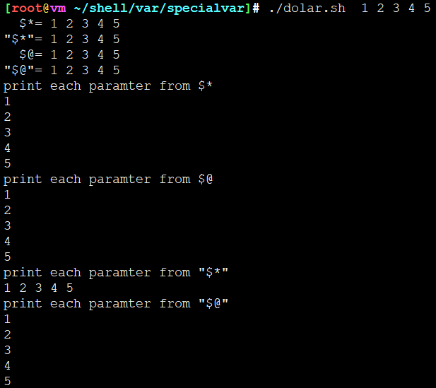

# 特殊变量


| 特殊变量 | 作用                                             |
| -------- | ------------------------------------------------ |
| $0       | 当前脚本的文件名（不带路经，带扩展名 .sh ）xx.sh |
| $NUM     | 返回第NUM个参数。( n>0 )                         |
| $#       | 统计传入的变量个数  e.g. ./xx.sh p1 p2     输出2 |
| $*       | 列出所有参数 。" $* " 整体列出                   |
| $@       | 列出所有参数 。"$@" 一一列出                     |
| $?       | 返回上一个命令执行的返回码                       |
| $$       | 返回当前shell进程pid                             |
| $!       | 最后运行的后台Process的pid                       |
| $-       | 列出Set命令设定的Flag                            |


## $*与$@区分

* $* 是一个**列表**，内容分别是 $1 $2 $3
* $* 环绕双引号的时候 "$*" 是一个**整体** "$1 $2 $3"
* $@ 是一个**列表**，内容分别是 $1 $2 $3
* $@ 环绕双引号的时候 "$@" 是一个**列表** "$1" "$2" "$3"
* 总之，没有引号都是列表，有引号$*是整体，$@是列表。$@永远都是列表，$*只在有引号的时候是整体

举栗子：

```
#!/bin/bash

echo "  \$*=" $*
echo "\"\$*\"=" "$*"

echo "  \$@=" $@
echo "\"\$@\"=" "$@"

echo "print each paramter from \$*"
for var in $*;do
	echo "$var"
done

echo "print each paramter from \$@"
for var in $@;do
	echo "$var"
done

echo "print each paramter from \"\$*\""
for var in "$*";do
	echo "$var"
done

echo "print each paramter from \"\$@\""
for var in "$@";do
	echo "$var"
done
```




## 参考

* <https://github.com/timo1160139211/shellCoding/blob/master/variable.sh>
