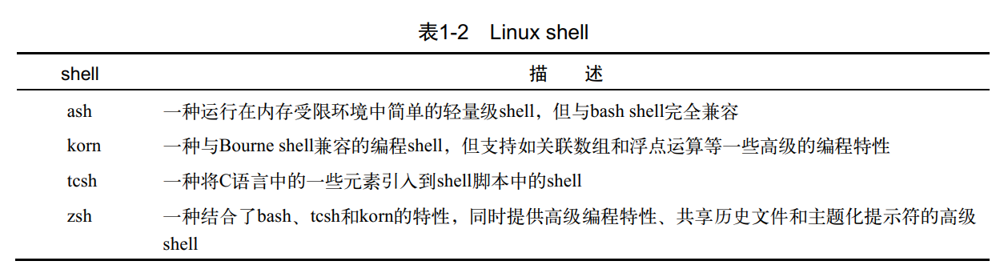

# 第1章-初识Linux_shell

## 总结

* 这个图看着很怪异，难道没有似曾相识的的感觉？
* Linux内核只负责内核，对上层提供支持，下面这个划分很奇怪呀

* 虚拟内存必不可少分段分页，页表机制

* 有了VFS，文件系统可以不用一开始就编译进内核。当然，启动引导所涉及的分区文件系统还是必须要有的，不然自举过程就是败了。

* shell种类众多，能生存下来肯定有他的优势

* X window其实是一个协议，X.org只是协议的一种实现。为嘛要X？字母W后是啥？明摆着跟微软较真。

* 我比较习惯CentOS和Ubuntu

