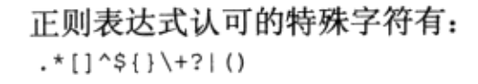

# 第20章-正则表达式


一个人希望掌握所有的正则表达式，却耗费了大量的时间，不知室外世事变迁，早已换了一个时代。

这个漫画讽刺了一些初学者，希望掌握一些比较复杂的东西的所有内容后再去做事，却不知道，这些东西过于复杂，你花费的时间可能很快就一文不值，因为它们可能已经过时了。

开发并不要求你掌握所有的内容，更多的时候，你只要能够掌握一些常用的，在真正需要用到的时候，再去查询一些比较详细的、不常用的内容即可。毕竟，没有人要求你马上做完所有事情。

## 什么是正则表达式


* BREs, 基本的正则表达式（Basic Regular Expression）
* EREs, 扩展的正则表达式（Extended Regular Expression）
* PREs, Perl 的正则表达式（Perl Regular Expression）


###  grep, egrep

```
1）grep 支持：BREs、EREs、PREs 正则表达式

    - grep 指令后不跟任何参数，则表示要使用 ”BREs“
    - grep 指令后跟 ”-E" 参数，则表示要使用 “EREs“
    - grep 指令后跟 “-P" 参数，则表示要使用 “PREs"

2）egrep 支持：EREs、PREs 正则表达式

    - egrep 指令后不跟任何参数，则表示要使用 “EREs”
    - egrep 指令后跟 “-P" 参数，则表示要使用 “PREs"

3）grep 与 egrep 正则匹配文件，处理文件方法

    a. grep 与 egrep 的处理对象：文本文件
    b. grep 与 egrep 的处理过程：查找文本文件中是否含要查找的 “关键字”（关键字可以是正则表达式） ，如果含有要查找的 ”关健字“，那么默认返回该文本文件中包含该”关健字“的该行的内容，并在标准输出中显示出来，除非使用了“>" 重定向符号,
    c. grep 与 egrep 在处理文本文件时，是按行处理的
```

### sed
```
1）sed 文本工具支持：BREs、EREs

    - sed 指令默认是使用"BREs"
    - sed 命令参数 “-r ” ，则表示要使用“EREs"

2）sed 功能与作用

    a. sed 处理的对象：文本文件
    b. sed 处理操作：对文本文件的内容进行 --- 查找、替换、删除、增加等操作
    c. sed 在处理文本文件的时候，也是按行处理的
```

### awk（gawk）

```
1）Awk 文本工具支持：EREs

    - awk 指令默认是使用 “EREs"

2）Awk 文本工具处理文本的特点

    a. awk 处理的对象：文本文件
    b. awk 处理操作：主要是对列进行操作
```

## 定义BRE模式

**最基本的BRE模式是匹配数据流中的文本字符**



* 特殊字符没有 ```# / - _ @ % & = ; ` , . \ ```
* 凡是要用到特殊字符都需要经过转移 \ 反斜杠字符

## 扩展的正则表达式

## 正则表达式实战


## 参考

* <https://www.jianshu.com/p/27c8b26faa9b>
* <https://deerchao.cn/tutorials/regex/regex.htm#mission>


## 小结


---
