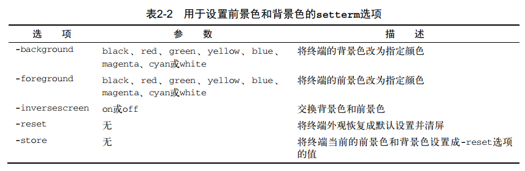

<!-- MDTOC maxdepth:6 firsth1:1 numbering:0 flatten:0 bullets:1 updateOnSave:1 -->

- [走进shell](#走进shell)   
   - [总结](#总结)   
   - [tty+pty+pts+ptmx](#ttyptyptsptmx)   
      - [tty(终端设备的统称):](#tty终端设备的统称)   
      - [pty（虚拟终端):](#pty（虚拟终端)   
      - [pts/ptmx(pts/ptmx结合使用，进而实现pty):](#ptsptmxptsptmx结合使用，进而实现pty)   
      - [dev目录下常见特殊文件](#dev目录下常见特殊文件)   
         - [串行端口终端(/dev/ttySn)](#串行端口终端devttysn)   
         - [伪终端(/dev/pty/)](#伪终端devpty)   
         - [控制终端(/dev/tty)](#控制终端devtty)   
         - [控制台终端(/dev/ttyn, /dev/console)](#控制台终端devttyn-devconsole)   
         - [虚拟终端(/dev/pts/n)](#虚拟终端devptsn)   
         - [其它类型](#其它类型)   
   - [setterm命令](#setterm命令)   

<!-- /MDTOC -->
# 走进shell

## 总结

* xterm是Linux中第一个可用的终端仿真器，能够仿真旧式终端硬件
* 图形界面下能够启动shell终端都是终端仿真器，常见的有GNOME Terminal（GNU系列发行版）、Konsole Terminal（KDE桌面）和xterm（老古董）

## tty+pty+pts+ptmx

### tty(终端设备的统称):
tty一词源于Teletypes，或者teletypewriters，原来指的是电传打字机，是通过串行线用打印机键盘通过阅读和发送信息的东西，后来这东西被键盘与显示器取代，所以现在叫终端比较合适。
终端是一种字符型设备，它有多种类型，通常使用tty来简称各种类型的终端设备。

### pty（虚拟终端):
但是如果我们远程telnet到主机或使用xterm时不也需要一个终端交互么？是的，这就是虚拟终端pty(pseudo-tty)

### pts/ptmx(pts/ptmx结合使用，进而实现pty):
pts(pseudo-terminal slave)是pty的实现方法，与ptmx(pseudo-terminal master)配合使用实现pty。

### dev目录下常见特殊文件

在Linux系统的设备特殊文件目录/dev/下，终端特殊设备文件一般有以下几种

#### 串行端口终端(/dev/ttySn)

串行端口终端(Serial Port Terminal)是使用计算机串行端口连接的终端设备。计算机把每个串行端口都看作是一个字符设备。有段时间这些串行端口设备通常被称为终端设备，因为 那时它的最大用途就是用来连接终端。这些串行端口所对应的设备名称是/dev/tts/0(或/dev/ttyS0), /dev/tts/1(或/dev/ttyS1)等，设备号分别是(4,0), (4,1)等，分别对应于DOS系统下的COM1、COM2等。若要向一个端口发送数据，可以在命令行上把标准输出重定向到这些特殊文件名上即可。例如， 在命令行提示符下键入：echo test > /dev/ttyS1会把单词”test”发送到连接在ttyS1(COM2)端口的设备上。可接串口来实验。

#### 伪终端(/dev/pty/)

伪终端(Pseudo Terminal)是成对的逻辑终端设备(即master和slave设备, 对master的操作会反映到slave上)。
例 如/dev/ptyp3和/dev/ttyp3(或者在设备文件系统中分别是/dev/pty/m3和 /dev/pty/s3)。它们与实际物理设备并不直接相关。如果一个程序把ptyp3(master设备)看作是一个串行端口设备，则它对该端口的读/ 写操作会反映在该逻辑终端设备对应的另一个ttyp3(slave设备)上面。而ttyp3则是另一个程序用于读写操作的逻辑设备。

这样，两个程序就可以通过这种逻辑设备进行互相交流，而其中一个使用ttyp3的程序则认为自己正在与一个串行端口进行通信。这很象是逻辑设备对之间的管道 操作。对于ttyp3(s3)，任何设计成使用一个串行端口设备的程序都可以使用该逻辑设备。但对于使用ptyp3的程序，则需要专门设计来使用 ptyp3(m3)逻辑设备。

例如，如果某人在网上使用telnet程序连接到你的计算机上，则telnet程序就可能会开始连接到设备 ptyp2(m2)上(一个伪终端端口上)。此时一个getty程序就应该运行在对应的ttyp2(s2)端口上。当telnet从远端获取了一个字符 时，该字符就会通过m2、s2传递给 getty程序，而getty程序就会通过s2、m2和telnet程序往网络上返回”login:”字符串信息。这样，登录程序与telnet程序就通 过“伪终端”进行通信。通过使用适当的软件，就可以把两个甚至多个伪终端设备连接到同一个物理串行端口上。

在使用设备文件系统 (device filesystem)之前，为了得到大量的伪终端设备特殊文件，使用了比较复杂的文件名命名方式。因为只存在16个ttyp(ttyp0—ttypf) 的设备文件，为了得到更多的逻辑设备对，就使用了象q、r、s等字符来代替p。例如，ttys8和ptys8就是一个伪终端设备对。不过这种命名方式目前 仍然在RedHat等Linux系统中使用着。

但Linux 系统上的Unix98并不使用上述方法，而使用了”pty master”方式，例如/dev/ptm3。它的对应端则会被自动地创建成/dev/pts/3。这样就可以在需要时提供一个pty伪终端。目录 /dev/pts是一个类型为devpts的文件系统，并且可以在被加载文件系统列表中看到。虽然“文件”/dev/pts/3看上去是设备文件系统中的 一项，但其实它完全是一种不同的文件系统。

即TELNET ---> TTYP3(S3: slave) ---> PTYP3(M3: master) ---> GETTY

```
实验：
1、在X下打开一个或N个终端窗口
2、#ls /dev/pt*
3、关闭这个X下的终端窗口，再次运行；比较两次输出信息就明白了。
在RHEL4环境下: 输出为/dev/ptmx /dev/pts/1存在一(master)对多(slave)的情况
```

#### 控制终端(/dev/tty)

如果当前进程有控制终端(Controlling Terminal)的话，那么/dev/tty就是当前进程的控制终端的设备特殊文件。可以使用命令”ps –ax”来查看进程与哪个控制终端相连。对于你登录的shell，/dev/tty就是你使用的终端，设备号是(5,0)。使用命令”tty”可以查看它具体对应哪个实际终端设备。/dev/tty有些类似于到实际所使用终端设备的一个联接。


#### 控制台终端(/dev/ttyn, /dev/console)

在Linux 系统中，计算机显示器通常被称为控制台终端 (Console)。它仿真了类型为Linux的一种终端(TERM=Linux)，并且有一些设备特殊文件与之相关联：tty0、tty1、tty2 等。当你在控制台上登录时，使用的是tty1。使用Alt+[F1—F6]组合键时，我们就可以切换到tty2、tty3等上面去。tty1–tty6等 称为虚拟终端，而tty0则是当前所使用虚拟终端的一个别名，系统所产生的信息会发送到该终端上。因此不管当前正在使用哪个虚拟终端，系统信息都会发送到 控制台终端上。你可以登录到不同的虚拟终端上去，因而可以让系统同时有几个不同的会话期存在。只有系统或超级用户root可以向 /dev/tty0进行写操作 即下例：

```
1、# tty(查看当前TTY)
/dev/tty1
2、#echo "test tty0" > /dev/tty0
test tty0
```


#### 虚拟终端(/dev/pts/n)

在X windows模式下的伪终端。


#### 其它类型

Linux系统中还针对很多不同的字符设备存在有很多其它种类的终端设备特殊文件。例如针对ISDN设备的/dev/ttyIn终端设备等。这里不再赘述。


## setterm命令



```
root@ubuntu16:~# setterm --help

Usage:
 setterm [options]

Set the attributes of a terminal.

选项：
 --term          <terminal_name>   override TERM environment variable
 --reset                           reset terminal to power-on state
 --initialize                      display init string, and use default settings
 --default                         use default terminal settings
 --store                           save current terminal settings as default
 --cursor        [on|off]          display cursor
 --repeat        [on|off]          keyboard repeat
 --appcursorkeys [on|off]          cursor key application mode
 --linewrap      [on|off]          continue on a new line when a line is full
 --inversescreen [on|off]          swap colors for the whole screen
 --foreground    default|<color>   set foreground color
 --background    default|<color>   set background color
 --ulcolor       [bright] <color>  set underlined text color
 --hbcolor       [bright] <color>  set bold text color
                 <color>: black blue cyan green grey magenta red white yellow
 --bold          [on|off]          bold
 --half-bright   [on|off]          dim
 --blink         [on|off]          blink
 --underline     [on|off]          underline
 --reverse       [on|off]          swap foreground and background colors
 --clear         [all|rest]        clear screen and set cursor position
 --tabs          [<number>...]     set these tab stop positions, or show them
 --clrtabs       [<number>...]     clear these tab stop positions, or all
 --regtabs       [1-160]           set a regular tab stop interval
 --blank         [0-60|force|poke] set time of inactivity before screen blanks
 --dump          [<number>]        write vcsa<number> console dump to file
 --append        [<number>]        append vcsa<number> console dump to file
 --file          <filename>        name of the dump file
 --msg           [on|off]          send kernel messages to console
 --msglevel      0-8               kernel console log level
 --powersave     [on|vsync|hsync|powerdown|off]
                                   set vesa powersaving features
 --powerdown     [0-60]            set vesa powerdown interval in minutes
 --blength       [0-2000]          duration of the bell in milliseconds
 --bfreq         <number>          bell frequency in Hertz
 --version                         show version information and exit
 --help                            display this help and exit

For more details see setterm(1).
root@ubuntu16:~#
```


```
root@ubuntu16:~# setterm -foreground green
```

修改前景色，只是字体颜色


```
root@ubuntu16:~# setterm -background red
```

修改背景色，字体的背景

* 共有8种颜色可供选择，分别是black、 red、 green、 yellow、 blue、 magenta、 cyan和white（这种颜色在有些发行版中看起来像灰色）。
* 设置好了记得store存储设置，不然输入几次命令就会回退原来的样式，保存之后就算退出终端重新进入也是这个样式，但是再开一个tty就不是这个样式了。


